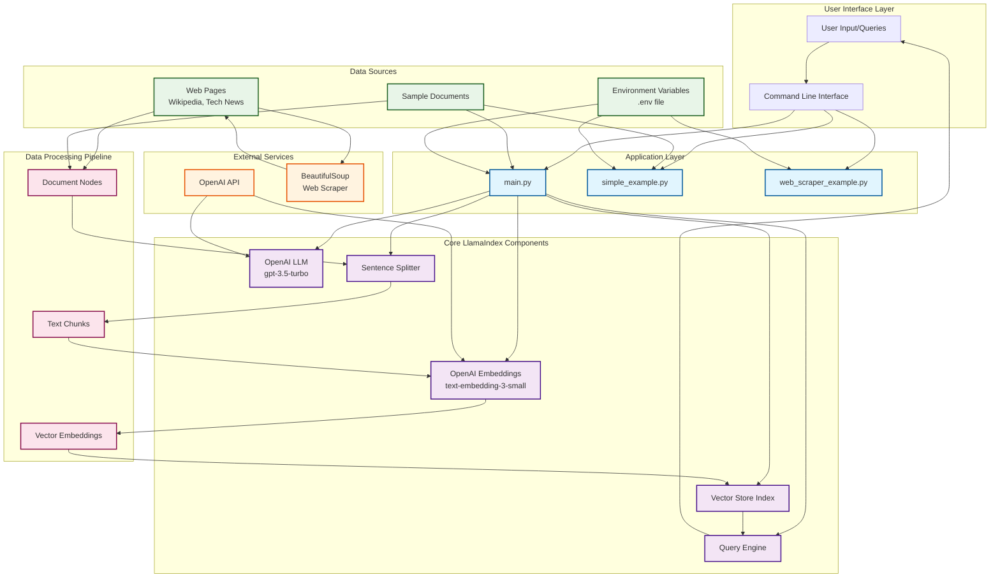
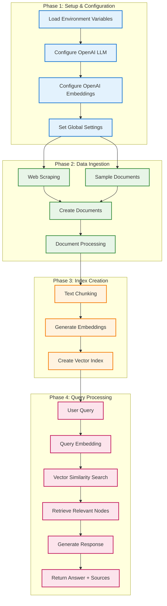
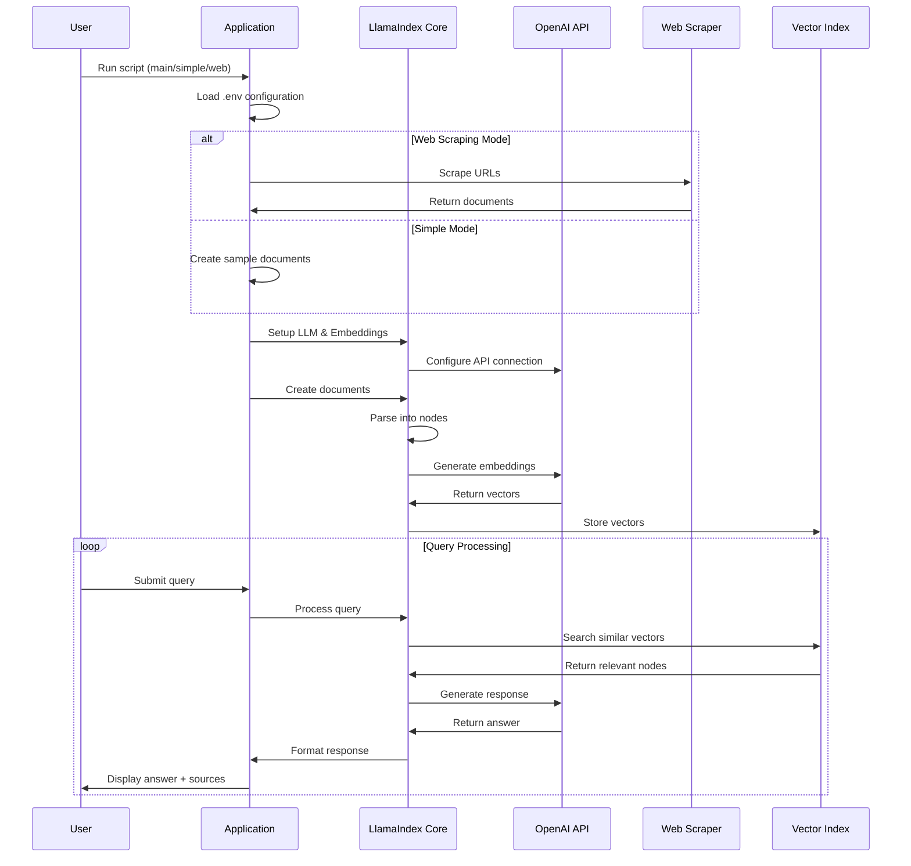
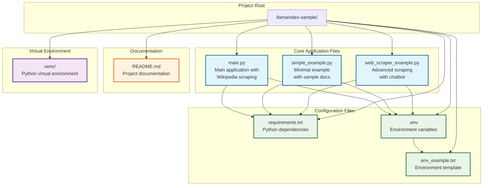
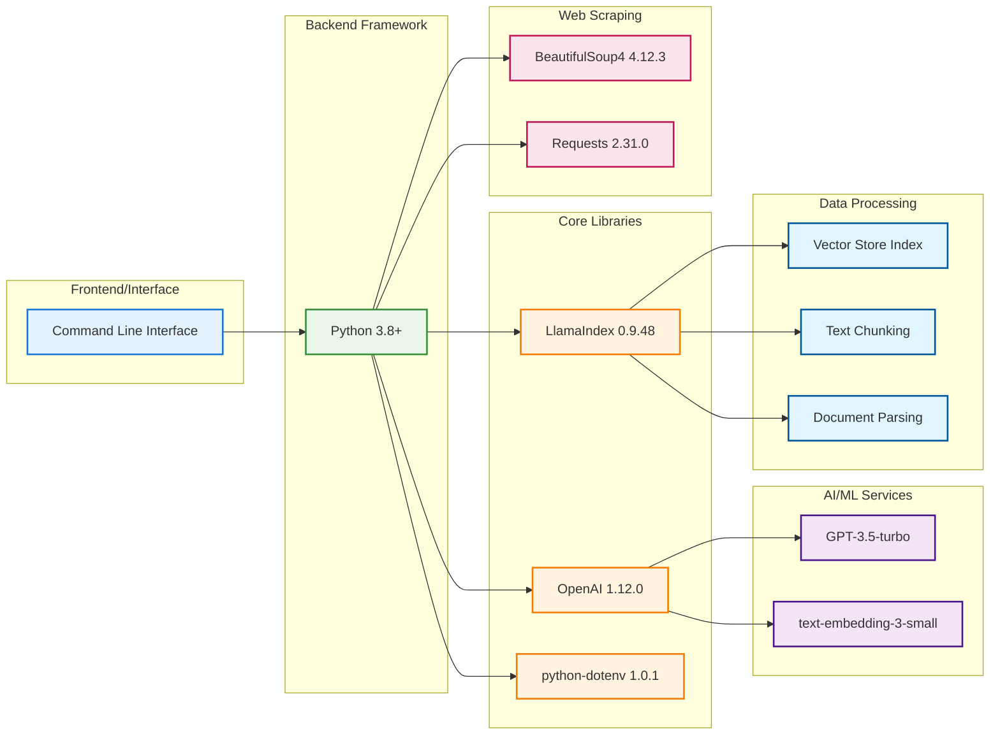

# LlamaIndex Sample Project - Architecture Diagram

## System Architecture Overview

## Data Flow Architecture

## Component Interaction Diagram

## File Structure and Dependencies

## Technology Stack

