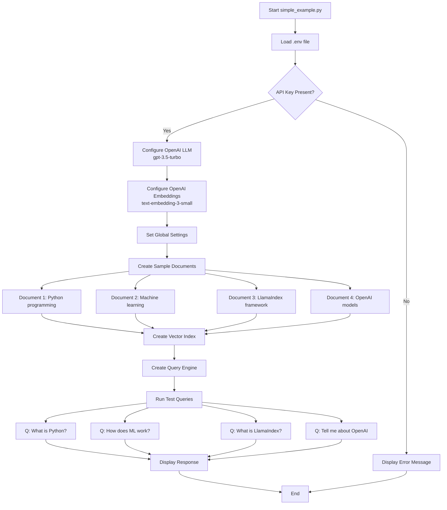
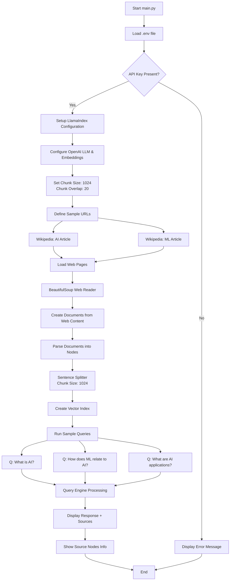
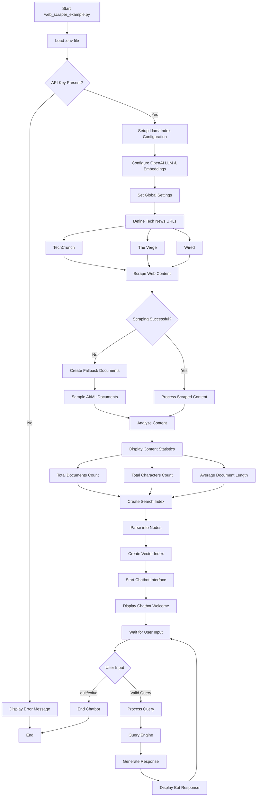
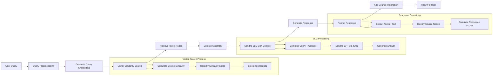
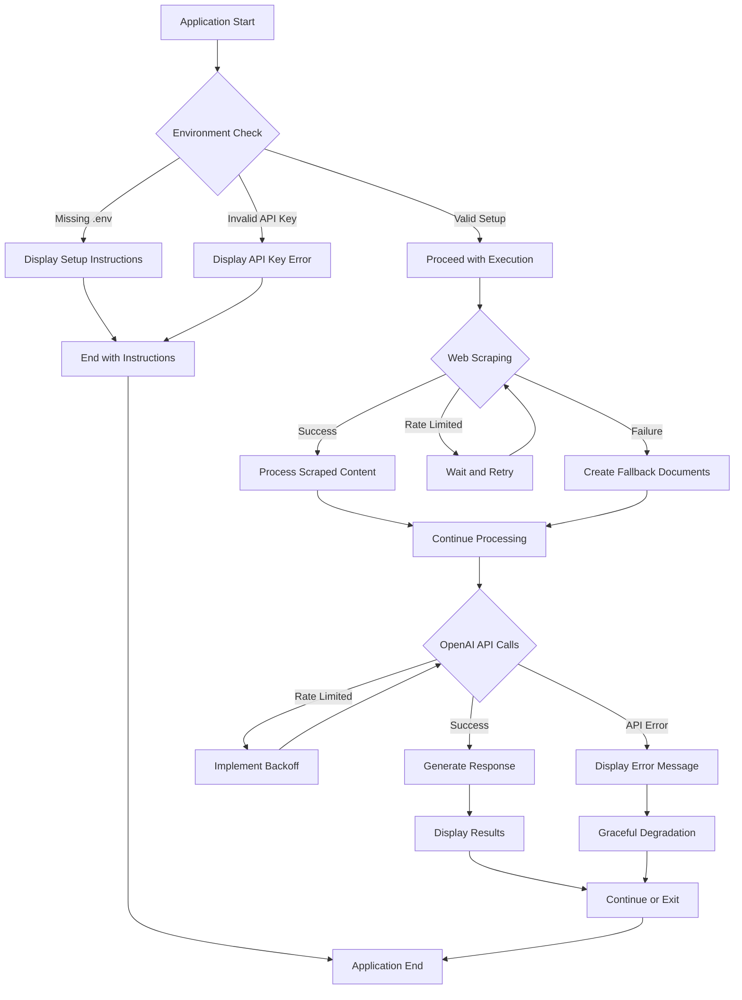
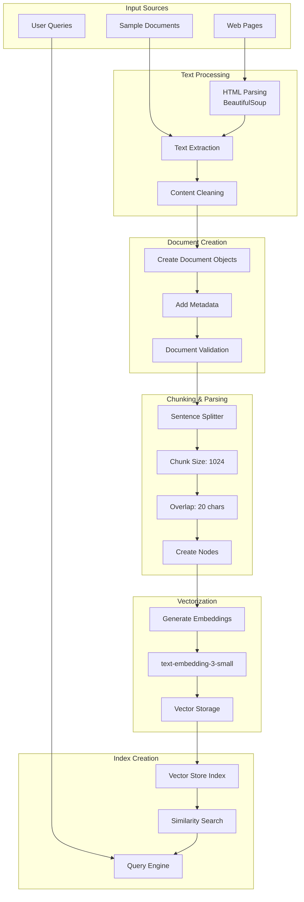

# LlamaIndex Sample Project - Execution Workflows

## 1. Simple Example Workflow (simple_example.py)

## 2. Main Application Workflow (main.py)

## 3. Advanced Web Scraper Workflow (web_scraper_example.py)

## 4. Query Processing Pipeline

## 5. Error Handling and Fallback Mechanisms

## 6. Data Transformation Pipeline

